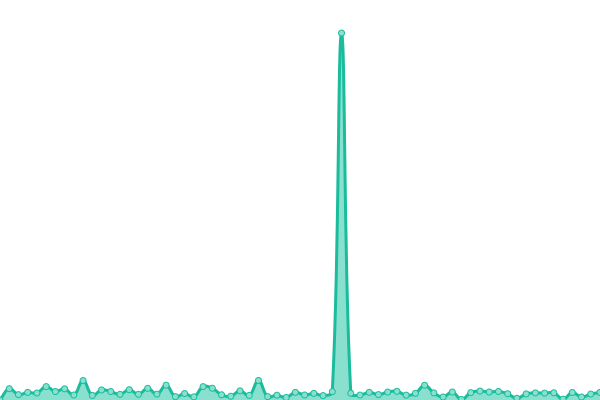

# [📈 Live Status](https://CloudHub-Social.github.io/Status): <!--live status--> **🟧 Partial outage**

This repository contains the open-source uptime monitor and status page for [CloudHub-Social](https://CloudHub-Social.github.io/Status), powered by [Upptime](https://github.com/upptime/upptime).

With [Upptime](https://upptime.js.org), you can get your own unlimited and free uptime monitor and status page, powered entirely by a GitHub repository. We use [Issues](https://github.com/CloudHub-Social/Status/issues) as incident reports, [Actions](https://github.com/CloudHub-Social/Status/actions) as uptime monitors, and [Pages](https://CloudHub-Social.github.io/Status) for the status page.

<!--start: status pages-->
<!-- This summary is generated by Upptime (https://github.com/upptime/upptime) -->
<!-- Do not edit this manually, your changes will be overwritten -->
<!-- prettier-ignore -->
| URL | Status | History | Response Time | Uptime |
| --- | ------ | ------- | ------------- | ------ |
|  [Authentik](https://auth.cloudhub.social) | 🟩 Up | [authentik.yml](https://github.com/CloudHub-Social/Status/commits/HEAD/history/authentik.yml) | 

 803ms
     
 | 

<a href="https://status.cloudhub.social/history/authentik">99.43%</a>
    

|  [Lemmy](https://lemmy.cloudhub.social) | 🟥 Down | [lemmy.yml](https://github.com/CloudHub-Social/Status/commits/HEAD/history/lemmy.yml) | 

 393ms
     
 | 

<a href="https://status.cloudhub.social/history/lemmy">99.20%</a>
    

|  [Mastodon](https://cloudhub.social) | 🟩 Up | [mastodon.yml](https://github.com/CloudHub-Social/Status/commits/HEAD/history/mastodon.yml) | 

 325ms
     
 | 

<a href="https://status.cloudhub.social/history/mastodon">99.43%</a>
    

<!--end: status pages-->

[**Visit our status website →**](https://CloudHub-Social.github.io/Status)

## 📄 License

- Powered by: [Upptime](https://github.com/upptime/upptime)
- Code: [MIT](./LICENSE) © [CloudHub-Social](https://CloudHub-Social.github.io/Status)
- Data in the `./history` directory: [Open Database License](https://opendatacommons.org/licenses/odbl/1-0/)
